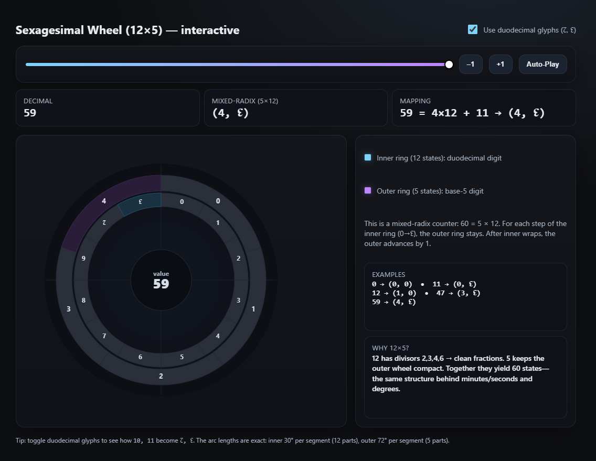

# Base-60 (Sexagesimal) Interactive Wheel

An interactive visualization of the Base-60 (sexagesimal) number system using a dual-ring wheel interface. This educational tool demonstrates how the ancient Babylonian counting system works through modern web technology.



## What is Base-60?

Base-60, also known as sexagesimal, is a numeral system with sixty as its base. It was used by ancient Babylonians and is still present today in:
- **Time measurement**: 60 seconds = 1 minute, 60 minutes = 1 hour
- **Angle measurement**: 360 degrees = 6 × 60 degrees
- **Geographic coordinates**: Minutes and seconds in latitude/longitude

## How This Visualization Works

The wheel uses a **mixed-radix system** with two concentric rings:

### Inner Ring (12 segments)
- Represents the duodecimal (base-12) digit
- Values: 0, 1, 2, 3, 4, 5, 6, 7, 8, 9, ↊ (10), ↋ (11)
- Each segment spans 30° (360° ÷ 12)

### Outer Ring (5 segments) 
- Represents the base-5 digit
- Values: 0, 1, 2, 3, 4
- Each segment spans 72° (360° ÷ 5)

### Counting Logic
- **Total combinations**: 5 × 12 = 60 possible states
- **Conversion**: `decimal_value = outer_digit × 12 + inner_digit`
- **Example**: Value 47 = (3, ↋) = 3 × 12 + 11

## Features

- **Interactive Controls**
  - Slider for direct value selection (0-59)
  - Increment/decrement buttons
  - Auto-play mode for animated counting
  
- **Keyboard Shortcuts**
  - `←` / `→` Arrow keys: Decrement/increment
  - `Space`: Toggle auto-play
  
- **Display Options**
  - Toggle between standard (A, B) and duodecimal (↊, ↋) glyphs
  - Real-time conversion display
  - Mathematical mapping explanation

- **Visual Feedback**
  - Active segments highlighted with distinct colors
  - Smooth gradient backgrounds
  - Responsive design

## Why 12 × 5?

This specific factorization of 60 offers unique advantages:

- **12 has many divisors** (2, 3, 4, 6): Enables clean fractional representations
- **5 keeps the outer ring compact**: Easy to visualize and interact with
- **Historical significance**: Mirrors the structure behind our time and angle systems

## Technology Stack

- **Frontend**: HTML5, CSS3, Vue.js 3
- **Graphics**: SVG for precise mathematical rendering
- **Architecture**: Modular design with separated concerns
  - `index.html`: Structure and Vue templates
  - `styles.css`: All styling and visual themes
  - `app.js`: Vue application logic and mathematics

## Getting Started

1. **Clone the repository**
   ```bash
   git clone https://github.com/DavidTbilisi/base60.git
   cd base60
   ```

2. **Open in browser**
   - Simply open `index.html` in any modern web browser
   - Or serve locally: `python -m http.server 8000`

3. **Interact with the wheel**
   - Use the slider to change values
   - Toggle duodecimal glyphs to see ↊ and ↋
   - Try auto-play to watch the counting animation

## Educational Value

This tool helps understand:
- **Mixed-radix number systems**
- **Historical number systems** and their modern applications
- **Mathematical visualization** concepts
- **The relationship** between different bases and their practical uses

## Examples

| Decimal | Mixed-radix | Meaning |
|---------|-------------|---------|
| 0       | (0, 0)      | Both rings at position 0 |
| 11      | (0, ↋)      | Inner ring at 11, outer at 0 |
| 12      | (1, 0)      | Inner wraps, outer advances |
| 47      | (3, ↋)      | 3×12 + 11 = 47 |
| 59      | (4, ↋)      | Maximum value |

## License

This project is open source and available under the [MIT License](LICENSE).

## Contributing

Contributions are welcome! Feel free to:
- Report bugs or suggest features
- Improve the documentation
- Add new visualization modes
- Enhance the educational content

---

*Made with ❤️ to make ancient mathematics accessible through modern technology*
